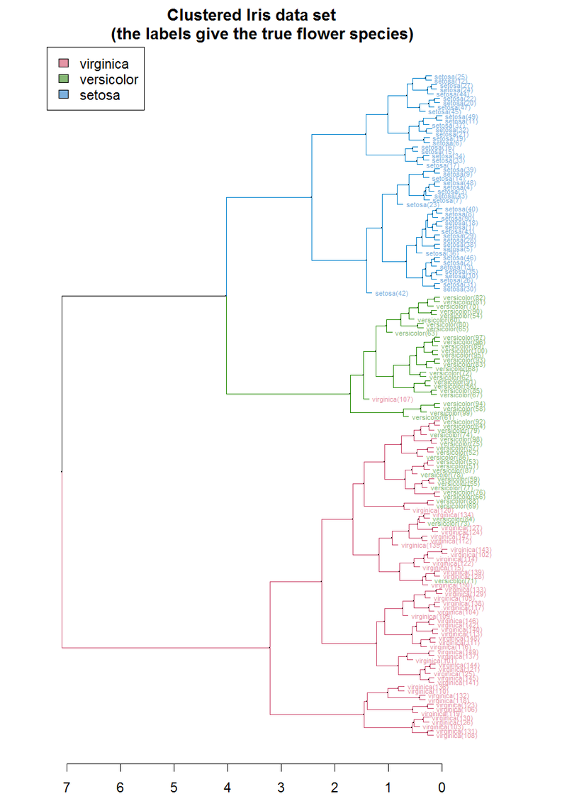

<meta charset="UTF-8">

 

<figure>

<figcaption>

Analyzing your data **for** you,  **with** you

</figcaption>
</figure>
  
   

  
<table>
<tbody>
<tr>
<td>
<figure>

<figcaption>

Transcriptome assembly with [Trinity](https://github.com/trinityrnaseq/trinityrnaseq/wiki)

</figcaption>
</figure>
</td>

<td>
<figure>

<figcaption>

Transcriptome annotation with [Trinotate](https://github.com/trinotate/trinotate.github.io/wiki)

</figcaption>
</figure>

</td>

<td>
<figure>

<figcaption>

Read alignment and counting

 Source: [JBrowse](https://jbrowse.org/docs/alignments.html)

</figcaption>
</figure>
</td>
</tr>

<tr>
<td>
<figure>

<figcaption>

Differential expression analysis

 Source: [Wikipedia](https://commons.wikimedia.org/wiki/File:Transcriptomes_heatmap_example.svg) 

</figcaption>
</figure>
</td>

<td>
<figure>

<figcaption>

Principal component analysis

 Source: [Wikipedia](https://en.wikipedia.org/wiki/Principal_component_analysis) 

</figcaption>
</figure>
</td>

<td>
<figure>

<figcaption>

Hierarchical clustering

 Source: [Wikipedia](https://en.wikipedia.org/wiki/Hierarchical_clustering) 

</figcaption>
</figure>
</td>

</tr>
</tbody>
</table>

