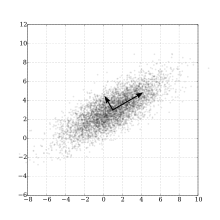

<meta charset="UTF-8">

  

 
**What we do**

<table>
<tr>

<td>
<figure>

<figcaption>

Transcriptome assembly with [Trinity](https://github.com/trinityrnaseq/trinityrnaseq/wiki)

</figcaption>
</figure>
</td>

<td>
<figure>

<figcaption>

Transcriptome annotation with [Trinotate](https://github.com/trinotate/trinotate.github.io/wiki)

</figcaption>
</figure>

</td>

<td>
<figure>

<figcaption>

Read alignment and counting

 Source: [JBrowse](https://jbrowse.org/docs/alignments.html)

</figcaption>
</figure>
</td>
</tr>

<tr>
<td>
<figure>

<figcaption>

Differential expression analysis

 Source: [Wikipedia](https://commons.wikimedia.org/wiki/File:Transcriptomes_heatmap_example.svg) 

</figcaption>
</figure>
</td>

<td>
<figure>

<figcaption>

Principal component analysis

 Source: [Wikipedia](https://en.wikipedia.org/wiki/Principal_component_analysis) 

</figcaption>
</figure>
</td>

<td>
<figure>

<figcaption>

Hierarchical clustering

 Source: [Wikipedia](https://en.wikipedia.org/wiki/Hierarchical_clustering) 

</figcaption>
</figure>
</td>

</tr>
</table>

<footer>
&nbsp;

<!-- 
Copyright &copy; 2020 MaKaCo, Inc. All rights reserved.
 -->

Get in touch with MaKaCo

[<i class="fab fa-github"></i>](https://github.com/makacom)     [<i class="fab fa-twitter"></i>]()     [<i class="fab fa-linkedin-in"></i>]()  

&nbsp;

</footer>

